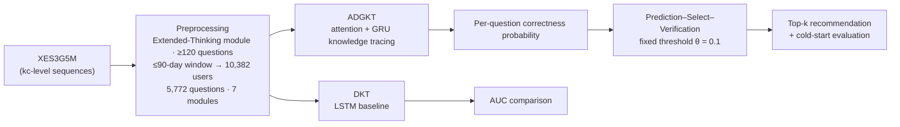
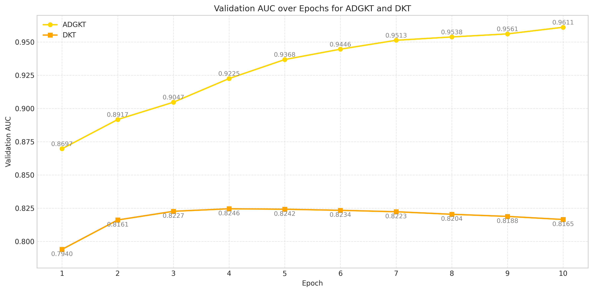
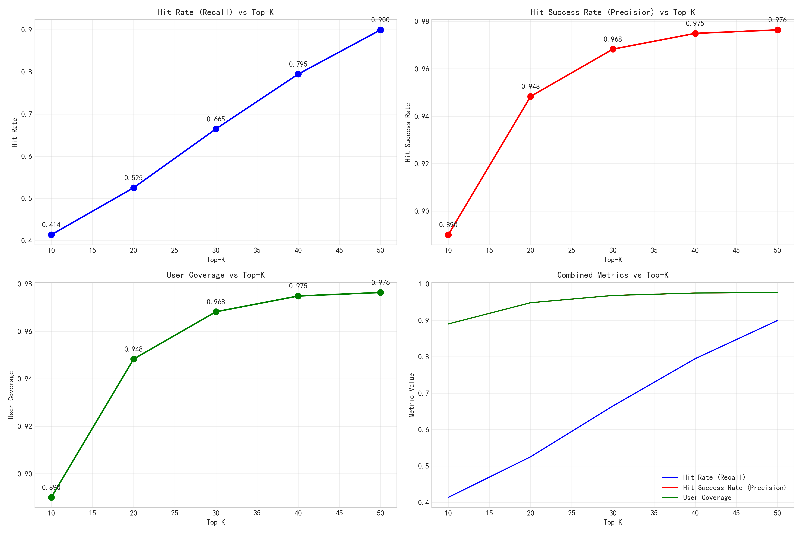
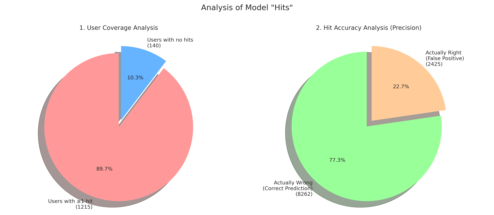
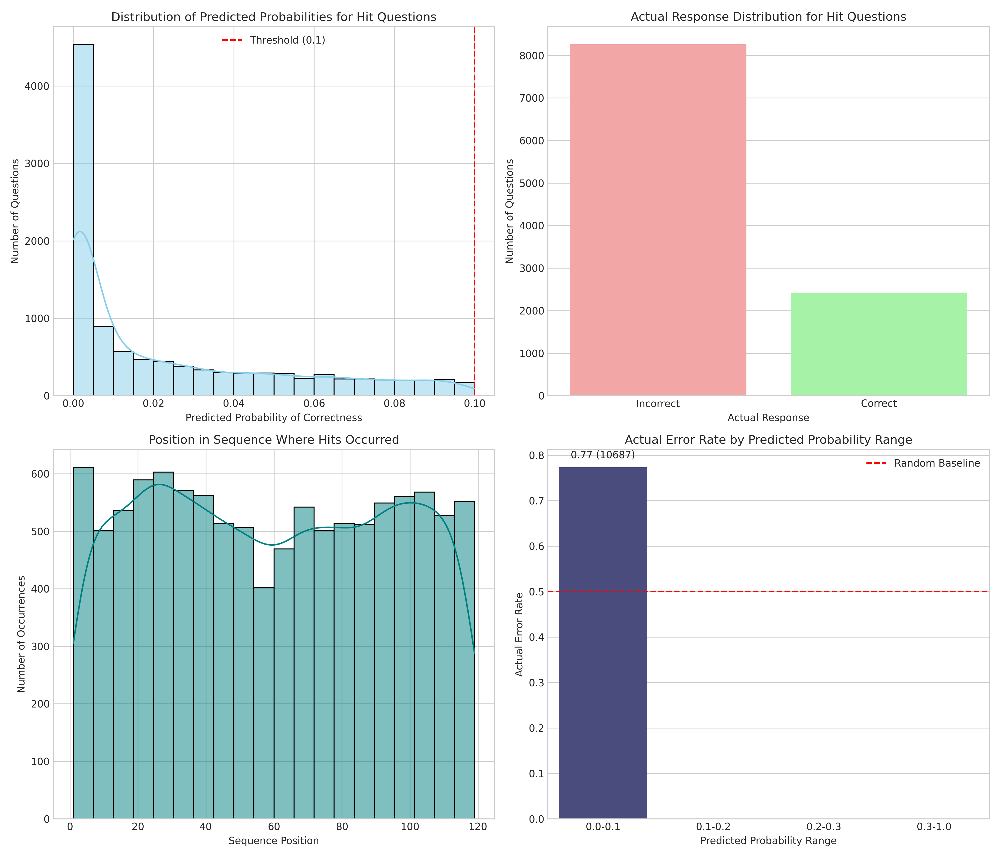
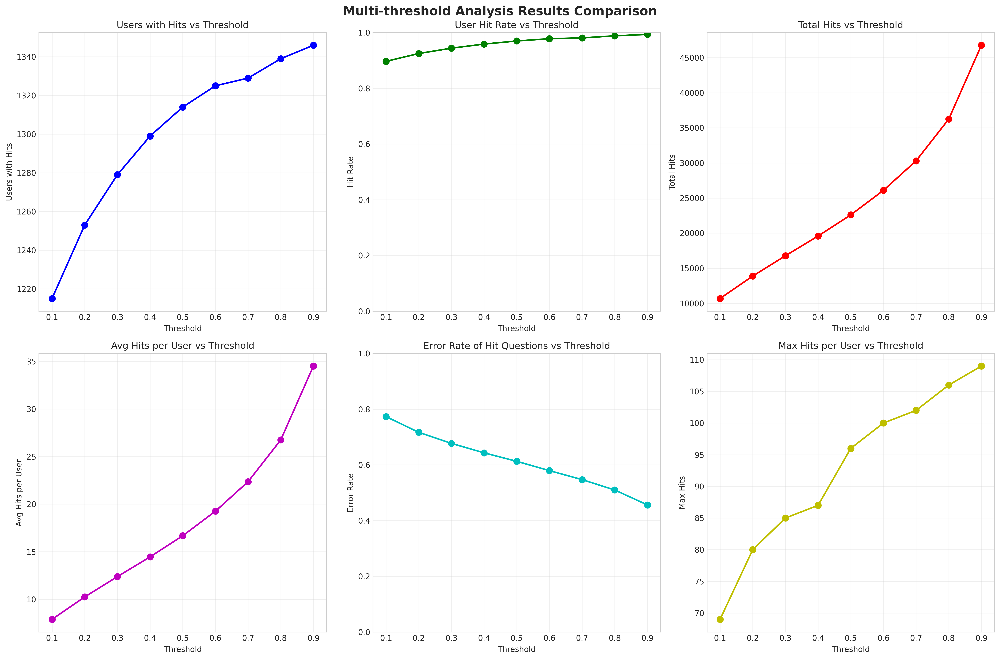
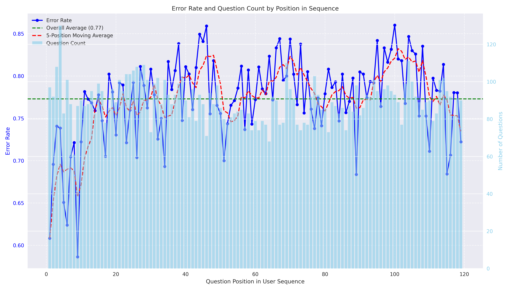

# Error-Driven Question Recommender

[](https://www.python.org/)
[](https://pytorch.org/)
[](https://jupyter.org/)
[](LICENSE)

A knowledge-tracing-based recommender that predicts **which questions a student
is about to answer incorrectly** — and recommends exactly those, so practice
time is spent on real knowledge gaps instead of comfortable repetition.

Built on the public [XES3G5M](https://github.com/ai4ed/XES3G5M) dataset
(NeurIPS 2023 Datasets & Benchmarks). Full write-up in
[`docs/report.pdf`](docs/report.pdf).

---

## Why "error-driven"?

Most practice systems recommend questions a student can already solve, which
keeps accuracy high but teaches little. This project inverts the objective:
**recommend the questions the model predicts the student will get wrong.**
That makes the recommendation a *diagnosis*, and it also makes the system easy
to evaluate — either the flagged questions really are the ones the student
fails, or they are not.

## Pipeline



### Models

- **ADGKT** (Attention-augmented Deep Knowledge Tracing) — question, concept
  and response embeddings are fused per interaction; multi-head self-attention
  (4 heads, residual + LayerNorm) captures cross-reference dependencies in the
  sequence; a GRU refines the temporal knowledge state; the target question's
  embeddings are concatenated with the sequence state to output a correctness
  probability. *(embed 128 · hidden 128 · dropout 0.2 · 10 epochs — see
  [`models/training_config.json`](models/training_config.json))*
- **DKT baseline** — canonical LSTM-based deep knowledge tracing with
  question–response embeddings, for an honest AUC reference point.

### Evaluation: Prediction–Select–Verification

Standard AUC alone cannot show whether a *recommender* finds the right
questions. The pipeline therefore adds a sequential validation framework:

1. **Predict** — mask everything after time *t*; the model scores all future
   questions.
2. **Select** — questions with predicted correctness probability below a fixed
   threshold (θ = 0.1) are flagged as "likely errors" and recommended.
3. **Verify** — unmask the student's actual future answers and check whether
   the flagged questions were really answered incorrectly.

This turns recommendation quality into a directly verifiable precision/coverage
statement per user, and is repeated across thresholds (0.1–0.9) for
sensitivity analysis. Top-k ranking and a cold-start setting (users disjoint
from training) are evaluated with the same machinery.

## Results

| Metric | Value |
|---|---|
| Validation AUC — ADGKT | **0.961** |
| Validation AUC — DKT baseline | 0.825 |
| Top-10 hit rate / coverage | 41.4% / 89.0% |
| Top-50 hit rate / coverage | 90.0% / 97.6% |
| Users with ≥1 verified hit (θ = 0.1) | 89.7% |
| Flagged questions actually answered wrong (θ = 0.1) | **77.3%** |
| Base error rate of retained users | ≈ 20% |
| **Lift over base error rate** | **≈ 3.7–3.9×** |

Model-flagged questions are wrong far more often than the ≈20% base rate —
the core claim of the error-driven approach. The final report's independent
cold-start evaluation reaches the same conclusion (74.4% hit success rate,
≈90% user coverage, 8.7 hits/user on average).

**Validation AUC — ADGKT vs DKT baseline**



**Top-k recommendation metrics** (hit rate = recall over future wrong
questions; hit success rate = precision of flagged questions; coverage = share
of users served)



**Prediction–Select–Verification at θ = 0.1** — of the 1,355 evaluated users,
89.7% received at least one verified hit, and 77.3% of all flagged questions
were indeed answered incorrectly (8,262 vs 2,425)



**Verified-hit anatomy** — predicted-probability distribution of hits, their
actual response split, where in the sequence they occur, and the actual error
rate (0.77) versus the 0.5 random baseline



**Threshold sensitivity (0.1 → 0.9)** — the coverage/precision trade-off of
the fixed-threshold strategy



**Error rate by sequence position** — no strong position effect; flagged
errors are not an artifact of late-sequence fatigue



Machine-readable outputs: [`results/topk_evaluation_results.json`](results/topk_evaluation_results.json),
[`results/per_user_topk_evaluation.csv`](results/per_user_topk_evaluation.csv).

## Repository structure

```
error-driven-question-recommender/
├── notebooks/
│   └── adgkt_msv_pipeline.ipynb    # end-to-end: EDA → preprocessing → training → evaluation
├── figures/                        # result figures (rendered above)
├── results/                        # evaluation outputs (JSON / CSV)
├── models/                         # trained ADGKT checkpoint + hyperparameters + id maps
├── docs/
│   └── report.pdf                  # full technical report (anonymized)
├── data/                           # empty — put XES3G5M here, see data/README.md
├── requirements.txt
└── LICENSE
```

## Getting started

```bash
pip install -r requirements.txt
```

Download the dataset (≈8 GB, only two subsets are actually needed) and place
it under `data/XES3G5M/` — step-by-step instructions in
[`data/README.md`](data/README.md). Then run the notebook top-to-bottom:

```bash
jupyter notebook notebooks/adgkt_msv_pipeline.ipynb
```

A GPU is recommended for training (the included checkpoint trains in ~10
epochs). The KC tree file (`kc_tree_with_qids.json`) is regenerated
automatically on first run. `models/adgkt_model_epoch10.pth` allows skipping
retraining for the evaluation sections.

## Roadmap

- [ ] Probability calibration (the model is over-confident at low probabilities)
- [ ] Learning-to-rank on top of predicted error probabilities
- [ ] Uncertainty estimation for high-stakes recommendations
- [ ] Explainable recommendations (which prior interactions caused the flag)
- [ ] Lightweight deployment (batch scoring API + monitoring)
- [ ] GraphRAG / LLM-agent layer for explanation-aware recommendation *(planned — not yet implemented)*

## Tech stack

Python · PyTorch · pandas / NumPy · scikit-learn · matplotlib / seaborn · Jupyter

---

## 中文简介

**错误驱动的题目推荐系统**：不推"学生已会做"的题，而是预测"学生即将做错"的题并精准推荐，把练习时间花在真正的知识漏洞上。

- **数据**：公开数据集 XES3G5M（NeurIPS 2023），筛取"思维拓展"模块、做题数 ≥120 且时间跨度 ≤90 天的用户，最终 10,382 名用户、5,772 道题、7 个顶层知识模块。
- **模型**：自研 **ADGKT**（多头自注意力 + GRU 的深度知识追踪），验证集 AUC **0.961**，显著高于 DKT 基线的 0.825。
- **评估**：设计 **Prediction–Select–Verification** 序贯验证框架——遮蔽未来作答、以固定阈值 θ=0.1 挑出"预测会错"的题，再用真实作答验证。结果：**77.3% 被标记的题确实做错**，相对 ≈20% 的基础错误率提升约 **3.7–3.9 倍**；Top-50 命中率 90%、用户覆盖率 97.6%；冷启动场景下命中率 74.4%。
- 完整技术报告见 [`docs/report.pdf`](docs/report.pdf)，全部结果可在 notebook 中复现。
