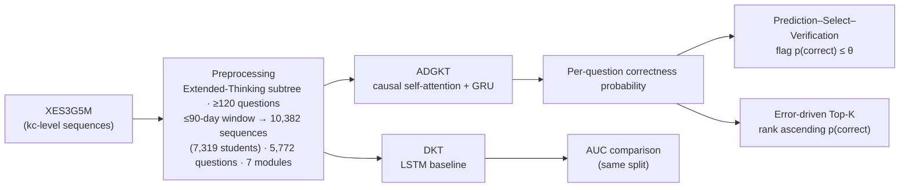

# Error-Driven Question Recommender

[](https://www.python.org/)
[](https://pytorch.org/)
[](LICENSE)

A knowledge-tracing-based recommender that predicts **which questions a student
is about to answer incorrectly** — and recommends exactly those, so practice
time goes to real knowledge gaps instead of comfortable repetition.

Built on the public [XES3G5M](https://github.com/ai4ed/XES3G5M) dataset
(NeurIPS 2023 Datasets & Benchmarks). Full write-up in
[`docs/report.pdf`](docs/report.pdf).

---

## Why "error-driven"?

Most practice systems recommend questions a student can already solve, which
keeps accuracy high but teaches little. This project inverts the objective:
**recommend the questions the model predicts the student will get wrong.**
That turns each recommendation into a *diagnosis* — and makes the system easy
to evaluate offline: either the flagged questions really are the ones the
student fails, or they are not.

## Pipeline



### Model — ADGKT (attention-augmented knowledge tracing)

Per interaction, question and module embeddings are fused and the response
embedding is added residually; one **causally-masked multi-head self-attention
block** (4 heads) retrieves relevant earlier interactions; a **GRU** condenses
the attended sequence into a temporal knowledge state; the state is
concatenated with the target question's embedding to output a correctness
probability (BCE loss, padding-masked). A canonical LSTM **DKT** baseline is
trained under the identical split for an honest reference.

*(embed 128 · hidden 128 · 4 heads · dropout 0.2 · 10 epochs · batch 32 —
see [`models/training_config.json`](models/training_config.json))*

### Evaluation — Prediction–Select–Verification (PSV)

Standard offline metrics cannot show whether a *recommender* picks the right
questions: there is no ground truth for "what would have happened if we had
recommended X". Strict set-matching against what the student naturally did
next fails almost completely. PSV sidesteps this by using the student's own
future as the verifier:

1. **Predict** — for every step *t*, the model sees only interactions before
   *t* and scores the next question.
2. **Select** — questions with p(correct) ≤ θ (default 0.1) are flagged as
   "likely errors" and recommended.
3. **Verify** — the student's actual response at *t* decides whether the flag
   was a true diagnosis.

Evaluation users come from the official XES3G5M `test.csv` split — **every
user is disjoint from training** (cold start by construction). The natural
error rate over the same evaluated positions provides the blind-pick baseline,
and θ is swept 0.1–0.9 to map the precision–coverage trade-off.

## Results

| Metric | Value |
|---|---|
| Validation AUC — ADGKT (causal-masked) | **0.839** |
| Validation AUC — DKT baseline | 0.825 |
| Evaluation users (zero overlap with training) | 1,355 |
| Natural error rate over evaluated positions | 22.3% |
| Flagged questions actually answered wrong (θ = 0.1) | **98.3%** |
| **Lift over natural error rate** | **4.4×** |
| Users with ≥1 verified weak point (θ = 0.1) | 84.7% |
| Avg flagged questions per user (θ = 0.1) | 4.0 |
| Full-catalog Top-K precision@10 / @50 | 0.2% / 0.2% |

The last row is the honest quantification of *why PSV is needed*: when the
recommender must pick from all 5,700+ unseen questions, checking against what
the student naturally does next almost never intersects (hit rates
0.2–1.5% for K = 10–50) — natural re-encounter is too sparse to validate a
recommender against. PSV instead verifies every flag directly against the
student's own future answers, at any operating threshold.

A balanced operating point is θ = 0.3: **85.6% precision, 90.9% user coverage,
≈8 flags per user** — the sweep maps the full trade-off.

Figures (regenerated by `python -m edqr.figures --data-dir data/XES3G5M`):

| Figure | File |
|---|---|
| Validation AUC — ADGKT vs DKT | [`figures/01_validation_auc.png`](figures/01_validation_auc.png) |
| Error-driven Top-K metrics | [`figures/02_topk_metrics.png`](figures/02_topk_metrics.png) |
| PSV hit summary at θ = 0.1 | [`figures/03_psv_summary.png`](figures/03_psv_summary.png) |
| Threshold sensitivity (0.1 → 0.9) | [`figures/04_threshold_sensitivity.png`](figures/04_threshold_sensitivity.png) |
| Error rate by sequence position | [`figures/05_error_rate_by_position.png`](figures/05_error_rate_by_position.png) |

Machine-readable outputs live in [`results/`](results/) —
`psv_results.json` (threshold sweep) and `topk_evaluation_results.json`.

## Repository structure

```
error-driven-question-recommender/
├── edqr/                       # importable package
│   ├── config.py               # dataclasses: data / model / train / eval settings
│   ├── data.py                 # filtering, id maps, dataset classes
│   ├── models.py               # ADGKT (causal attention) + DKT
│   ├── train.py                # python -m edqr.train --model adgkt|dkt
│   ├── evaluate.py             # PSV + error-driven Top-K evaluation
│   └── figures.py              # README figures from results files
├── notebooks/
│   └── walkthrough.ipynb       # end-to-end demo on a sample of users
├── figures/                    # result figures (rendered above)
├── results/                    # evaluation outputs (JSON)
├── models/                     # checkpoints, id maps, training logs
├── docs/
│   └── report.pdf              # course technical report (anonymized)
├── data/                       # empty — put XES3G5M here (see data/README.md)
└── requirements.txt
```

## Getting started

```bash
pip install -r requirements.txt
```

Download the dataset (only two subsets are needed; ≈8 GB total) and place it
under `data/XES3G5M/` — instructions in [`data/README.md`](data/README.md).

```bash
# 1. train (GPU recommended; ~10 epochs)
python -m edqr.train --model adgkt --data-dir data/XES3G5M
python -m edqr.train --model dkt  --data-dir data/XES3G5M

# 2. evaluate (the shipped checkpoint can skip step 1)
python -m edqr.evaluate --mode sweep --data-dir data/XES3G5M
python -m edqr.evaluate --mode topk  --data-dir data/XES3G5M

# 3. regenerate README figures
python -m edqr.figures --data-dir data/XES3G5M
```

## Changelog — v2 refactor

This repository was refactored from a single 123-cell notebook into the
`edqr` package, and **three correctness bugs in the original implementation
were fixed** along the way:

1. **Label leakage in attention (the big one).** The original
   `nn.MultiheadAttention` call passed no `attn_mask`, so the prediction for
   step *t* could attend to interaction *t+1* — whose embedding contains the
   very response being predicted. Validation AUC was inflated to ≈0.96 and
   the ADGKT-vs-DKT gap was largely an artifact of this leak. The attention
   now uses a lower-triangular causal mask; PSV-style evaluation (history
   only) was never affected.
2. **Loss mask collision.** `mask = (target_q > 0)` silently dropped every
   target mapped to question id 0. Ids now start at 1 and the mask is
   length-based.
3. **Duplicate "cold-start" section.** The notebook's cold-start cell
   re-ran the main evaluation; README numbers cited from a different,
   unreproducible run. The official test split (users disjoint from
   training) now *is* the documented cold-start setting.

Reported numbers come from the fixed code, are reproducible with the commands
above, and are therefore lower — and honest.

## Roadmap

- [ ] Probability calibration (the model is over-confident at low probabilities)
- [ ] Learning-to-rank on top of predicted error probabilities
- [ ] Dose control: mix diagnosis questions with reach questions (85% rule)
- [ ] Explainable flags (which prior interactions caused the prediction)
- [ ] Lightweight deployment (batch scoring API + monitoring)

## Tech stack

Python · PyTorch · pandas / NumPy · scikit-learn · matplotlib · Jupyter

---

## 中文简介

**错误驱动的题目推荐系统**：不推"学生已会做"的题，而是预测"学生即将做错"的题并精准推荐，把练习时间花在真正的知识漏洞上。

- **数据**：公开数据集 XES3G5M（NeurIPS 2023），筛取"拓展思维"子树、做题数 ≥120 且时间跨度 ≤90 天的用户，最终 10,382 条序列（7,319 名学生）、5,772 道题、7 个顶层知识模块；评估使用官方 test 划分中与训练完全零重叠的用户。
- **模型**：注意力增强的知识追踪模型 **ADGKT**（因果掩码多头自注意力 + GRU 混合架构）与 DKT 基线在同一划分下对照。
- **评估**：设计 **Prediction–Select–Verification** 序贯验证协议——遮蔽未来作答、标记"预测会错"的题、用真实作答回验。θ=0.1 时 **98.3% 被标记的题确实做错**，相对自然错误率 22.3% 放大约 **4.4 倍**；并以 0.1–0.9 阈值扫描刻画精度–覆盖权衡。
- v2 重构修复了原实现的三处缺陷（注意力标签泄漏、损失掩码碰撞、不可复现的冷启动数字），所有结果可由上述命令复现。完整技术报告见 [`docs/report.pdf`](docs/report.pdf)。
